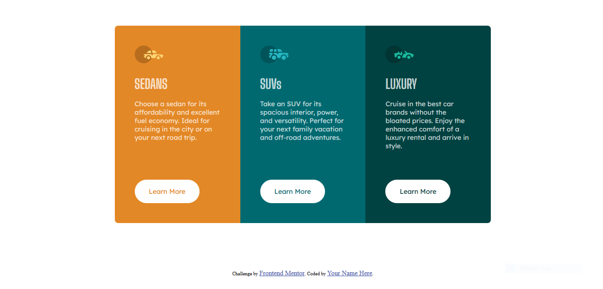

# Frontend Mentor - 3-column preview card component solution

This is a solution to the [3-column preview card component challenge on Frontend Mentor](https://www.frontendmentor.io/challenges/3column-preview-card-component-pH92eAR2-). Frontend Mentor challenges help you improve your coding skills by building realistic projects. 

## Table of contents

- [Overview](#overview)
  - [The challenge](#the-challenge)
  - [Screenshot](#screenshot)
  - [Links](#links)
- [My process](#my-process)
  - [Built with](#built-with)
- [Author](#author)

## Overview

To recreate the component shown in:

### The challenge

Users should be able to:

- View the optimal layout depending on their device's screen size
- See hover states for interactive elements

### Screenshot

My solution:

### Links

<!-- - Solution URL:  -->
- Live Site: [Live Site](https://tombirbeck.github.io/frontend-mentor-column-preview-challenge/)

## My process

To begin with I created a CSS file and then added a CSS reset. I then set up custom CSS variables.\
Next, I set up a bacis HTML structure for the page before adding styling, using a mobile first design workflow.

### Built with

- Semantic HTML5 markup
- CSS custom properties
- Flexbox
- CSS Grid
- Mobile-first workflow

## Author

- Website - [Portfolio](https://portfolio-tombirbeck.vercel.app/)
- Frontend Mentor - [@TomBirbeck](https://www.frontendmentor.io/profile/TomBirbeck)

